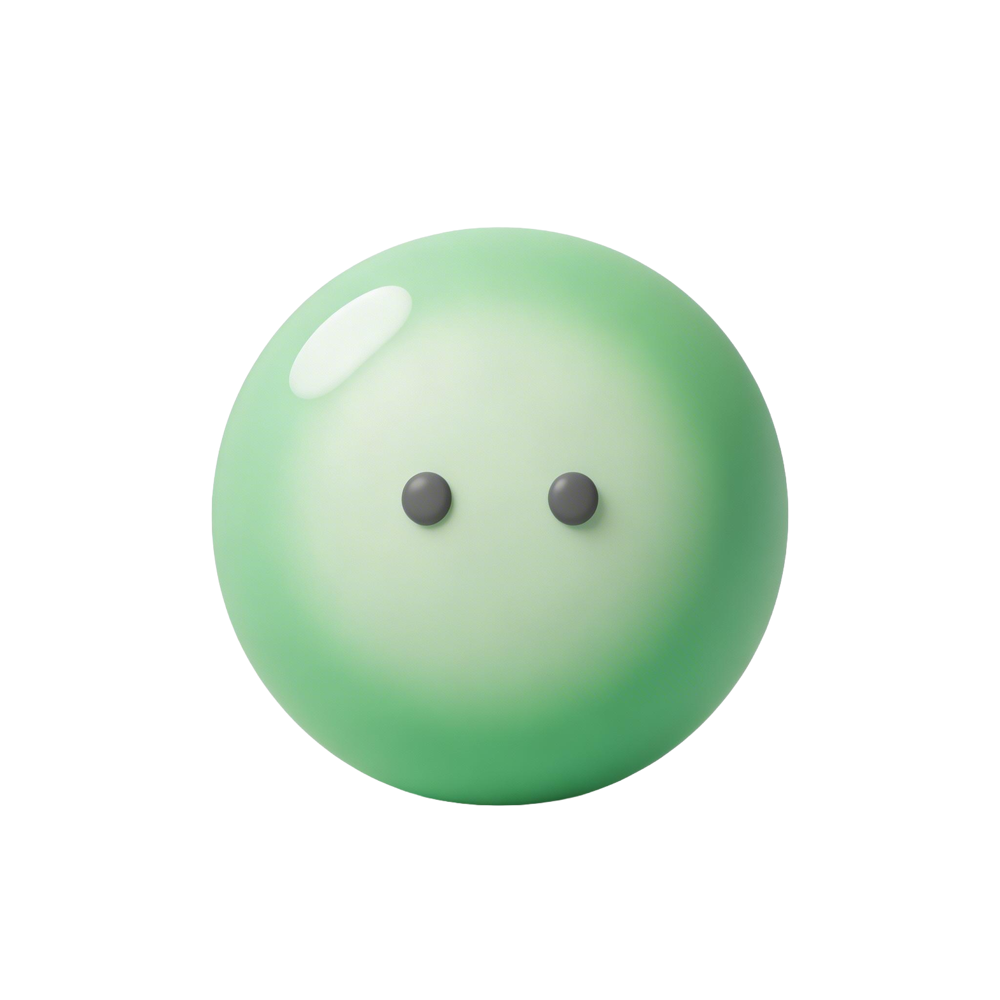
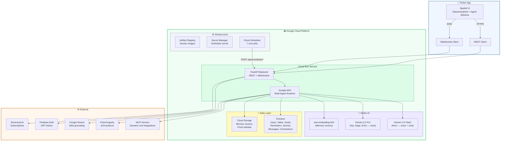
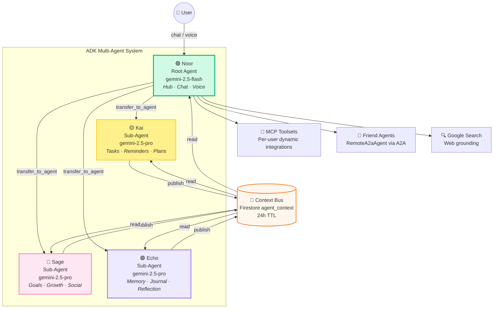

<p align="center">
  
</p>

<h1 align="center">Jems — Your Spatial AI Operating System</h1>

<p align="center">
  A multi-agent personal assistant powered by Google Gemini, built as a spatial OS with glassmorphism UI, autonomous planning, semantic memory, and social connectivity.
</p>

<p align="center">
  
  
  
  
  
  
</p>

---

## Overview

Jems is a personal AI companion app with four specialized agents — Noor, Kai, Sage, and Echo — each owning a distinct screen and domain. The agents coordinate through a shared context bus, use semantic vector memory for long-term recall, and connect to external tools via MCP (Model Context Protocol) and friend agents via A2A (Agent-to-Agent) protocol.

---

## System Architecture



---

## Multi-Agent Hierarchy



---

## Data Flow — Chat Message Lifecycle

```mermaid
sequenceDiagram
    participant U as 👤 User (Flutter)
    participant WS as WebSocket
    participant API as FastAPI
    participant ADK as ADK Runtime
    participant Noor as 🟢 Noor
    participant Sub as 🟡/🩷/🟣 Sub-Agent
    participant Gemini as Gemini API
    participant Tools as Agent Tools
    participant FS as Firestore
    participant GCS as Cloud Storage

    U->>WS: {"type":"text", "text":"Plan my week"}
    WS->>API: Route to agent session
    API->>ADK: Create/resume session
    ADK->>Noor: Process user message
    Noor->>Gemini: Generate response (Flash)

    alt Domain-specific request
        Noor->>Sub: transfer_to_agent (Kai)
        Sub->>Gemini: Generate with tools (Pro)
        Sub->>Tools: create_task(), create_reminder()
        Tools->>FS: Write tasks/reminders
        Sub->>Tools: publish_context()
        Tools->>FS: Write to agent_context
        Sub-->>ADK: Tool results + response
    else General conversation
        Noor->>Tools: remember_fact(), web_search()
        Tools->>GCS: Store memory vector
        Noor-->>ADK: Response text
    end

    ADK-->>API: Stream events
    API-->>WS: {"type":"event", "text":"...", "author":"kai"}
    WS-->>U: Render in spatial UI
    API-->>WS: {"type":"turn_complete"}
